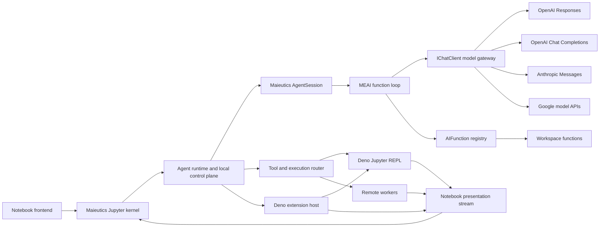

# Agent Platform Architecture

Status: Accepted

Date: 2026-07-16

## Purpose

Maieutics is a notebook-native agent hosted as a Jupyter kernel. The architecture must support multiple model APIs,
a stateful TypeScript REPL backed by `deno jupyter`, out-of-process Deno extensions, and execution targets located on
other machines or inside containers.

This document records the stable boundaries required before those features are implemented. It does not prescribe
their complete implementation.

## System shape



The .NET process remains the user-facing Jupyter kernel. It is also a Jupyter client when communicating with a Deno
REPL kernel. Model requests, credentials, the canonical transcript, policy decisions, and notebook output routing stay
in the local control plane. Filesystem and process tools may execute on a selected local or remote execution target.

## Architectural invariants

1. The canonical transcript is provider-neutral and is the authoritative conversation state.
2. Provider continuation identifiers are optional checkpoints, not the only copy of conversation state.
3. Agent Core does not depend on provider SDKs, Jupyter, extension IPC, SSH, containers, or a worker transport.
4. Jupyter Client and Kernel libraries remain independent and never reference each other.
5. The executable composition root may reference both Client-backed and Kernel-backed adapters.
6. Rich tool output has separate model-facing and notebook-facing projections.
7. Large or binary values cross boundaries through artifact references rather than repeated base64 payloads.
8. Filesystem paths are scoped to an execution target and are not assumed to be local paths.
9. Every run, tool call, worker operation, artifact, and display has a stable correlation identifier.
10. Cancellation, backpressure, terminal failure, and disposal are explicit parts of every streaming boundary.
11. Raw provider objects, raw Jupyter messages, and raw worker protocol messages do not enter the Agent domain model.
12. Model credentials remain in the control plane and are not forwarded to execution workers.
13. Microsoft.Extensions.AI supplies the model and function primitives, while Maieutics owns run, event, limit, and
    transcript semantics.
14. `IChatClient` is the provider boundary; provider capability negotiation remains Maieutics-owned.

## Target logical modules

The boundaries below are logical ownership boundaries. A logical module starts as a namespace unless it has an
independent consumer, publication or deployment target, target framework, or dependency boundary that requires a
separate assembly. The reusable Jupyter Client and Kernel libraries and future worker executables remain separate
assemblies. Product-specific provider wiring and the user-facing Jupyter adapter currently live in the executable.

```text
Maieutics.Agent
    Provider-neutral transcript, content, sessions, runs, events, tools, capabilities, and the internal
    FunctionInvokingChatClient loop. Each run captures an immutable model-client/options profile lease. It is currently
    an internal, non-packable product assembly rather than a supported SDK

Maieutics.Providers.*
    Executable-owned IChatClient construction and configuration for OpenAI Responses, OpenAI Chat Completions,
    Anthropic Messages, and Google APIs. Extract only when an adapter gains an independent consumer

Maieutics.Providers.OpenAI
    Current executable namespace. Selects Responses or Chat Completions while keeping OpenAI SDK types behind
    IChatClient

Maieutics.Providers.Anthropic
    Current executable namespace. Implements an AOT-safe Anthropic Messages IChatClient adapter with explicit JSON and
    SSE mapping

Maieutics.Notebook
    Ordered presentation events, artifacts, display correlation, and component contracts

Maieutics.Agent.Deno
    IReplSession implementation backed by Maieutics.Jupyter.Client

Maieutics.Jupyter
    Executable-owned user-facing kernel adapter backed by Maieutics.Jupyter.Kernel

Maieutics.Extensions.Deno
    Out-of-process Deno extension discovery, lifecycle hooks, REPL contributions, and versioned IPC

Maieutics.Execution
    Execution targets, operation contracts, policies, workspace URIs, and artifact references

Maieutics.Execution.Protocol
    Versioned worker wire contract, independent of a concrete transport

Maieutics.Worker
    Local, SSH-launched, or container-hosted execution-plane process

Maieutics
    AOT executable, product-specific adapters, provider registry, last-known-good configuration reload, DI composition,
    process hosting, and lifecycle
```

## Dependency direction

```text
Maieutics.Providers.* ------> Maieutics.Agent through IChatClient
Execution adapters --------> Maieutics.Execution + Maieutics.Agent
Maieutics.Agent.Deno ------> Maieutics.Agent + Maieutics.Notebook + Jupyter.Client
Maieutics.Jupyter ----------> Maieutics.Agent + Maieutics.Notebook + Jupyter.Kernel
Maieutics executable ------> selected libraries and future independently reusable adapters
```

No reverse references are allowed. In particular, the Deno REPL adapter must not reference the Jupyter Kernel project,
and the user-facing kernel adapter must not reference the Jupyter Client project merely to control Deno.

## Relationship to AGENTS.md

`AGENTS.md` summarizes the active implementation constraints from these decisions. ADR 0003 establishes that the
primary stateful TypeScript REPL is a real `deno jupyter` kernel and Maieutics connects to it as a Jupyter client.

ADR 0004 retains a separate process boundary for independently deployable Deno script extensions. They extend REPL
behavior or observe host lifecycle events through a dedicated IPC protocol. They are not MCP servers and are not exposed
to the model as tools.

ADR 0010 supersedes ADR 0006. `Maieutics.Agent` now uses Microsoft.Extensions.AI directly and owns one-run enforcement,
limits, transactional transcript commit, normalized events, and cancellation without Microsoft Agent Framework.

ADR 0009 keeps the initial canonical transcript process-local while fixing the future durable shape: immutable turn
metadata and session heads reference raw content-addressed blobs rather than embedding binary bodies in JSON.

ADR 0012 supersedes the notebook control cell syntax examples in ADR 0008: the canonical cell forms are `%model` and
`%workspace`, `%maieutics` remains a deprecated alias, and a leading slash only triggers completion discovery.

The current tool loop uses a per-run `FunctionInvokingChatClient` over an immutable `AIFunction` registry. A recording
decorator preserves every provider iteration so canonical history includes assistant function calls, provider call IDs,
function results, and the final assistant response. Maieutics adds bounded invocation context, limits, three-stage tool
events, and stable JSON result envelopes around the standard function contract.

The executable registers `list_directory`, `read_text`, and `search_text` from one cohesive `WorkspaceFunctions`
implementation and `repl_execute`, `repl_create`, `repl_list`, `repl_restart`, and `repl_close` from the local Deno
REPL adapter. The startup root is fixed from configuration, while
`%workspace use` may install a session override for subsequent function invocations and `reset` restores the
startup root. Workspace functions capture one immutable workspace snapshot per call; a Deno REPL captures the selected
root once as its process working directory at session creation. The snapshot owns URI validation,
`.git` denial, symbolic-link and regular-file checks, verified opening, and bounded reads.

Provider-specific tool shapes are normalized at the `IChatClient` adapter boundary:

- JSON-schema `AIFunction` values map to ordinary function tools for OpenAI Responses, Chat Completions, and Anthropic;
- a future free-form tool such as `apply_patch` retains one canonical Maieutics string argument, even when
  a Responses adapter can use a native custom tool before immediately normalizing its call;
- provider-hosted search, file-library, computer, or similar tools are explicit model capabilities. A provider without
  an equivalent returns unsupported rather than silently substituting a different Maieutics tool.

Potential hosted capability compatibility is computed per configured source and model as the intersection of the
source's API format (declared by the provider adapter) with the vendor's served capabilities (built-in catalog or
`Maieutics:Vendors`, narrowed per model); explicit `Maieutics:Endpoints` profiles add on top for the effective set.
Known vendors trust the full potential by default; unknown gateways require explicit profiles. Only the
provider-neutral effective names reach the Agent run profile.

Responses wire items, provider SDK objects, and built-in tool state never enter the public Agent API or canonical
transcript.

## Decisions

- [ADR 0001](decisions/0001-provider-neutral-model-boundary.md): Provider-neutral model boundary
- [ADR 0002](decisions/0002-agent-session-run-content-model.md): Agent sessions, runs, and content
- [ADR 0003](decisions/0003-deno-jupyter-repl-output-bridge.md): Deno Jupyter REPL and notebook output bridge
- [ADR 0004](decisions/0004-deno-extension-protocol.md): Out-of-process Deno extensions and lifecycle hooks
- [ADR 0005](decisions/0005-distributed-execution.md): Distributed execution control and worker planes
- [ADR 0006](decisions/0006-selective-microsoft-agent-framework-adoption.md): Selective Microsoft Agent Framework
  adoption (superseded by ADR 0010)
- [ADR 0007](decisions/0007-runtime-configuration-and-hot-reload.md): Runtime configuration location and hot reload
- [ADR 0008](decisions/0008-model-profile-catalog-and-session-selection.md): Model profile catalog and session selection
- [ADR 0009](decisions/0009-volatile-transcript-and-durable-storage-shape.md): Volatile transcript and durable storage
  shape
- [ADR 0010](decisions/0010-direct-microsoft-extensions-ai-function-runtime.md): Direct Microsoft.Extensions.AI
  function runtime
- [ADR 0011](decisions/0011-deno-repl-tools-lifecycle-and-output-routing.md): Deno REPL tools, lifecycle, and output
  routing
- [ADR 0012](decisions/0012-flat-notebook-command-syntax-and-slash-completion.md): Flat notebook command syntax and
  slash completion
- [ADR 0013](decisions/0013-mcp-configuration-file.md): Separate MCP configuration file
- [ADR 0014](decisions/0014-deno-repl-ipc-and-http-control.md): Deno REPL sideband IPC and HTTP control channel
- [ADR 0015](decisions/0015-turn-budget-and-truncation.md): Turn budgets and truncated turn commits
- [ADR 0016](decisions/0016-script-plugins-and-extension-points.md): Out-of-process script plugins and
  symbol-identified extension points

## Explicitly deferred

- Exact worker message encoding and network transport
- Exact Deno extension IPC encoding and transport
- Component frontend framework and MIME type
- Artifact-store and durable-transcript implementation
- Provider SDK selection for future non-OpenAI adapters
- Microsoft Agent Framework, including Workflows, hosting, A2A, AG-UI, Durable Task, and MCP integration
- Worker scheduling, pooling, and multi-tenant deployment

These choices must be made behind the boundaries above and must not require changes to Agent Core contracts.
