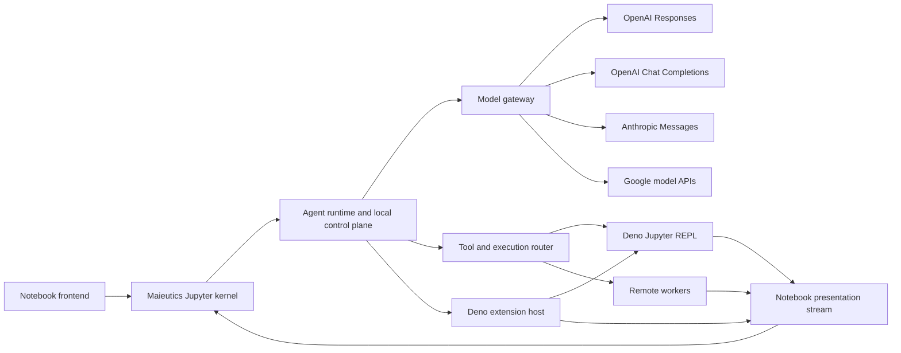

# Agent Platform Architecture

Status: Accepted

Date: 2026-07-16

## Purpose

Maieutics is a notebook-native agent hosted as a Jupyter kernel. The architecture must support multiple model APIs,
a stateful TypeScript REPL backed by `deno jupyter`, out-of-process Deno extensions, and execution targets located on
other machines or inside containers.

This document records the stable boundaries required before those features are implemented. It does not prescribe
their complete implementation.

## System shape



The .NET process remains the user-facing Jupyter kernel. It is also a Jupyter client when communicating with a Deno
REPL kernel. Model requests, credentials, the canonical transcript, policy decisions, and notebook output routing stay
in the local control plane. Filesystem and process tools may execute on a selected local or remote execution target.

## Architectural invariants

1. The canonical transcript is provider-neutral and is the authoritative conversation state.
2. Provider continuation identifiers are optional checkpoints, not the only copy of conversation state.
3. Agent Core does not depend on provider SDKs, Jupyter, extension IPC, SSH, containers, or a worker transport.
4. Jupyter Client and Kernel libraries remain independent and never reference each other.
5. The executable composition root may reference both Client-backed and Kernel-backed adapters.
6. Rich tool output has separate model-facing and notebook-facing projections.
7. Large or binary values cross boundaries through artifact references rather than repeated base64 payloads.
8. Filesystem paths are scoped to an execution target and are not assumed to be local paths.
9. Every run, tool call, worker operation, artifact, and display has a stable correlation identifier.
10. Cancellation, backpressure, terminal failure, and disposal are explicit parts of every streaming boundary.
11. Raw provider objects, raw Jupyter messages, and raw worker protocol messages do not enter the Agent domain model.
12. Model credentials remain in the control plane and are not forwarded to execution workers.

## Target logical modules

The boundaries below are logical ownership boundaries. They may begin as namespaces, but provider SDKs, Jupyter Client
and Kernel dependencies, and worker executables should remain in separate assemblies.

```text
Maieutics.Agent
    Provider-neutral transcript, content, sessions, runs, events, tools, and capabilities

Maieutics.Agent.Providers.*
    OpenAI Responses, OpenAI Chat Completions, Anthropic Messages, and Google adapters

Maieutics.Notebook
    Ordered presentation events, artifacts, display correlation, and component contracts

Maieutics.Agent.Deno
    IReplSession implementation backed by Maieutics.Jupyter.Client

Maieutics.Agent.Jupyter
    User-facing kernel adapter backed by Maieutics.Jupyter.Kernel

Maieutics.Extensions.Deno
    Out-of-process Deno extension discovery, lifecycle hooks, REPL contributions, and versioned IPC

Maieutics.Execution
    Execution targets, operation contracts, policies, workspace URIs, and artifact references

Maieutics.Execution.Protocol
    Versioned worker wire contract, independent of a concrete transport

Maieutics.Worker
    Local, SSH-launched, or container-hosted execution-plane process

Maieutics
    Configuration, DI composition, process hosting, and lifecycle only
```

## Dependency direction

```text
Provider adapters ---------> Maieutics.Agent
Execution adapters --------> Maieutics.Execution + Maieutics.Agent
Maieutics.Agent.Deno ------> Maieutics.Agent + Maieutics.Notebook + Jupyter.Client
Maieutics.Agent.Jupyter ---> Maieutics.Agent + Maieutics.Notebook + Jupyter.Kernel
Maieutics executable ------> all selected adapters and hosts
```

No reverse references are allowed. In particular, the Deno REPL adapter must not reference the Jupyter Kernel project,
and the user-facing kernel adapter must not reference the Jupyter Client project merely to control Deno.

## Relationship to AGENTS.md

`AGENTS.md` contains earlier target guidance that describes Deno as a custom IPC child tool and not a second Jupyter
stack by default. ADR 0003 supersedes that default for the primary stateful TypeScript REPL: the REPL is provided by a
real `deno jupyter` kernel and Maieutics connects to it as a Jupyter client.

ADR 0004 retains a separate process boundary for independently deployable Deno script extensions. They extend REPL
behavior or observe host lifecycle events through a dedicated IPC protocol. They are not MCP servers and are not exposed
to the model as tools.

## Decisions

- [ADR 0001](decisions/0001-provider-neutral-model-boundary.md): Provider-neutral model boundary
- [ADR 0002](decisions/0002-agent-session-run-content-model.md): Agent sessions, runs, and content
- [ADR 0003](decisions/0003-deno-jupyter-repl-output-bridge.md): Deno Jupyter REPL and notebook output bridge
- [ADR 0004](decisions/0004-deno-extension-protocol.md): Out-of-process Deno extensions and lifecycle hooks
- [ADR 0005](decisions/0005-distributed-execution.md): Distributed execution control and worker planes

## Explicitly deferred

- Exact worker message encoding and network transport
- Exact Deno extension IPC encoding and transport
- Component frontend framework and MIME type
- Artifact-store implementation
- Transcript persistence format
- Provider SDK selection within each adapter
- Worker scheduling, pooling, and multi-tenant deployment

These choices must be made behind the boundaries above and must not require changes to Agent Core contracts.
